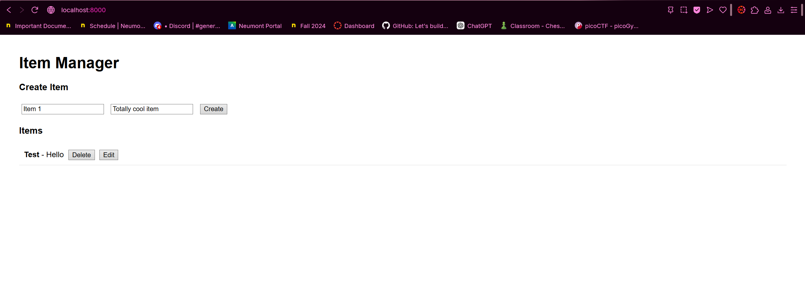

# AIE300-project

Simple API built with FastAPI that manages in memory items

GitHub link: https://github.com/RamLoka/AIE300-project

---

## Installation

1. Clone the repository:

git clone https://github.com/RamLoka/AIE300-project
cd AIE300-project

2. Create virtual environment 

python -m venv venv
# Windows
venv\Scripts\activate
# macOS/Linux
source venv/bin/activate

3. Install dependencies 

pip install -r requirements.

## Running the server

Start the FastAPI server

uvicorn main:app --reload

API URL: http://127.0.0.1:8000
Interactive Swagger UI: http://127.0.0.1:8000/docs

## API Endpoints

Method	Endpoint	Description				Status Code
GET		/items		Get all items			200
GET		/items/{id}	Get a single item by ID	200 / 404
POST	/items		Create a new item		201
PUT		/items/{id}	Update an existing item	200 / 404
DELETE	/items/{id}	Delete an item by ID	200 / 404

## Database

DB: MongoDB

I chose MongoDB because it is simple, flexible and my data is document-based.

## Docker Setup

Prerequisites:

- Docker Desktop 
- Docker Compose 
- Git 

From the root project directory: docker compose up --build

## Accessing the App

Once running open your browser

Frontend UI: http://localhost:8000
API endpoint: http://localhost:8000/items
API status: http://localhost:8000/api

## Stopping the Application

docker compose down

## Rebuilding the Application

docker compose up --build

## Architecture

        ┌────────────────────────────┐
        │        Frontend           │
        │          (HTML)           │
        │  http://localhost:8000   │
        └───────────┬──────────────┘
                    │ HTTP (fetch)
                    ▼
        ┌────────────────────────────┐
        │       FastAPI Backend     │
        │   app/main.py (API)      │
        │  http://localhost:8000   │
        └───────────┬──────────────┘
                    │ async MongoDB driver (Motor)
                    ▼
        ┌────────────────────────────┐
        │        MongoDB            │
        │   Database Container      │
        │   Port: 27017             │
        └────────────────────────────┘

## Endpoints

# Health Check
- GET /
Returns API status message

# Items (CRUD)
- GET /items
Get all items

- GET /items/{item_id}
Get a single item by ID

- POST /items
Create a new item

- PUT /items/{item_id}
Update an existing item

- DELETE /items/{item_id}
Delete an item by ID

# Frontend (Static)
- GET /
Serves the frontend (index.html) via StaticFiles

## Frontend Image

