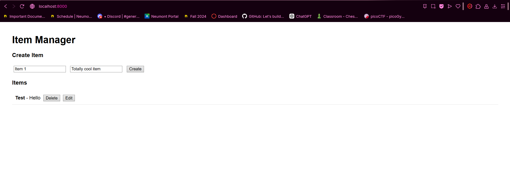
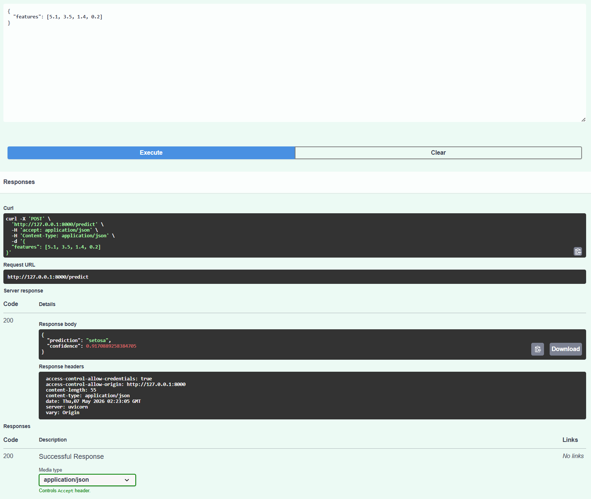

# AIE300-project

Simple API built with FastAPI that manages in memory items

GitHub link: https://github.com/RamLoka/AIE300-project

---

## Installation

1. Clone the repository:

git clone https://github.com/RamLoka/AIE300-project
cd AIE300-project

2. Create virtual environment 

python -m venv venv
# Windows
venv\Scripts\activate
# macOS/Linux
source venv/bin/activate

3. Install dependencies 

pip install -r requirements.

## Running the server

Start the FastAPI server

uvicorn main:app --reload

API URL: http://127.0.0.1:8000
Interactive Swagger UI: http://127.0.0.1:8000/docs

## API Endpoints

Method	Endpoint	Description				Status Code
GET		/items		Get all items			200
GET		/items/{id}	Get a single item by ID	200 / 404
POST	/items		Create a new item		201
PUT		/items/{id}	Update an existing item	200 / 404
DELETE	/items/{id}	Delete an item by ID	200 / 404

## Database

DB: MongoDB

I chose MongoDB because it is simple, flexible and my data is document-based.

## Docker Setup

Prerequisites:

- Docker Desktop 
- Docker Compose 
- Git 

From the root project directory: docker compose up --build

## Accessing the App

Once running open your browser

Frontend UI: http://localhost:8000
API endpoint: http://localhost:8000/items
API status: http://localhost:8000/api

## Stopping the Application

docker compose down

## Rebuilding the Application

docker compose up --build

## Architecture

        ┌────────────────────────────┐
        │        Frontend           │
        │          (HTML)           │
        │  http://localhost:8000   │
        └───────────┬──────────────┘
                    │ HTTP (fetch)
                    ▼
        ┌────────────────────────────┐
        │       FastAPI Backend     │
        │   app/main.py (API)      │
        │  http://localhost:8000   │
        └───────────┬──────────────┘
                    │ async MongoDB driver (Motor)
                    ▼
        ┌────────────────────────────┐
        │        MongoDB            │
        │   Database Container      │
        │   Port: 27017             │
        └────────────────────────────┘

## Endpoints

# Health Check
- GET /
Returns API status message

# Items (CRUD)
- GET /items
Get all items

- GET /items/{item_id}
Get a single item by ID

- POST /items
Create a new item

- PUT /items/{item_id}
Update an existing item

- DELETE /items/{item_id}
Delete an item by ID

# Feature Prediction
POST /predict

Request Body:
{
  "features": [5.1, 3.5, 1.4, 0.2]
}

Response:
{
  "prediction": "setosa",
  "confidence": 0.98
}

# Frontend (Static)
- GET /
Serves the frontend (index.html) via StaticFiles

## Frontend Image

## Prediction Screenshot (Swagger UI)

## Docker Model Runner Part 1:

Model image pulled: ai/smollm2
Endpoint exposed: http://localhost:12434/engines/v1/chat/completions
Response: Docker is a tool that allows you to run multiple isolated applications and containers on a single machine.

## Architecture Diagram

Client
   │
Frontend (static UI)
   │
API Service (:8000)
   │   ├── /predict (proxies request)
   │   └── /health (API status)
   │
Model Service (:8001)
   │   ├── /predict (runs PyTorch model)
   │   └── /health (model status)
   │
Prediction Response

## Prompt Engineering & Structured Output

# What system message do you use? Why?

You are an item analysis assistant.

Analyze provided item description and respond with valid JSON in this exact format: 
{ "categories": ["category1", "category2"], "tags": ["tag1", "tag2", "tag3"], 
"sentiment": "positive" | "negative" | "neutral", "summary": "one sentence summary"

Rules:
- Return ONLY valid JSON 
- No markdown 
- No explanations 
- No extra text

## What few-shot examples do you include?

Example: Input: "This gaming laptop is extremely fast, lightweight, and has amazing battery life." Output: 
{ "categories": ["technology", "electronics"], "tags": ["gaming", "laptop", "battery", "performance"], 
"sentiment": "positive", "summary": "Positive review of a high-performance gaming laptop." }

## What structured format do you expect?

The endpoint expects the model to return valid JSON in this format:

{
    "categories": ["category1", "category2"],
    "tags": ["tag1", "tag2", "tag3"],
    "sentiment": "positive",
    "summary": "one sentence summary"
}

Required fields:

categories
tags
sentiment
summary

## How do you handle failures?

The model output is validated using json.loads().

If invalid json is returned:

1. The application extracts the JSON object from the response text
2. A retry request is sent asking the model to return ONLY valid JSON
3. The retry uses a lower temperature for more consistent output
4. If parsing still fails, the API returns HTTP 422 with an error message

All required fields are verified before returning response